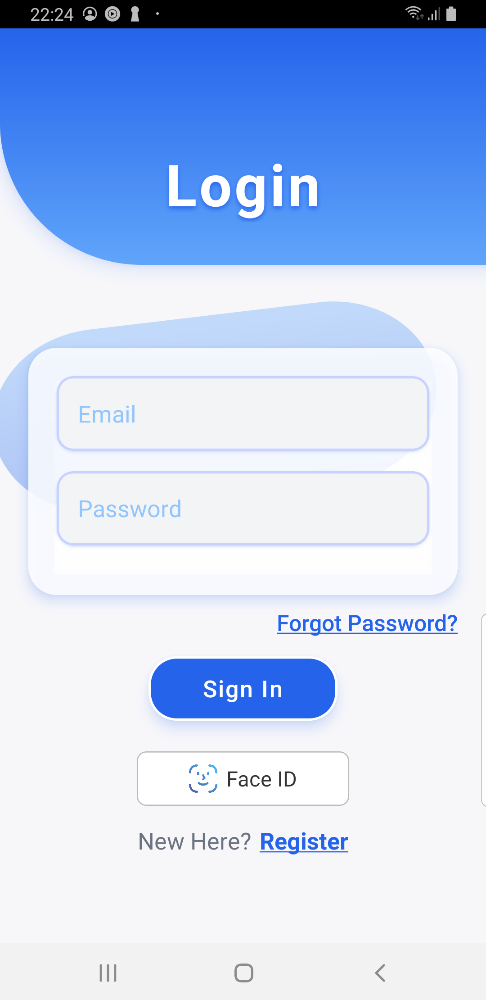
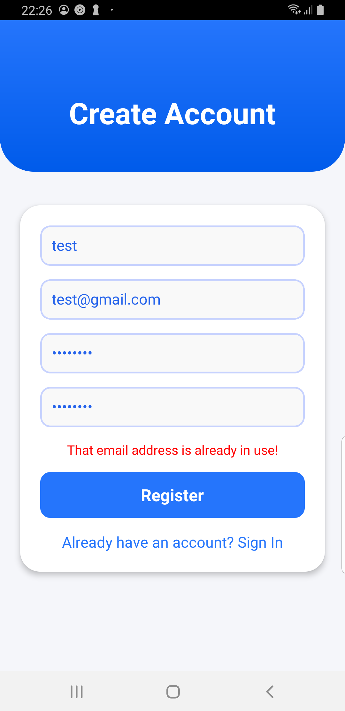
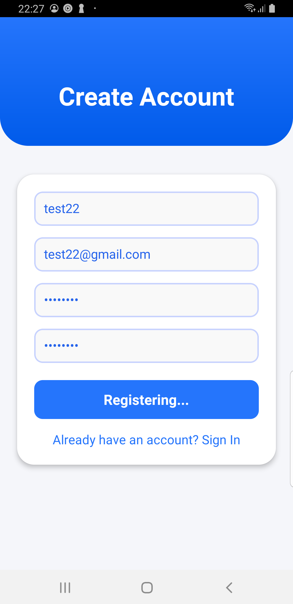
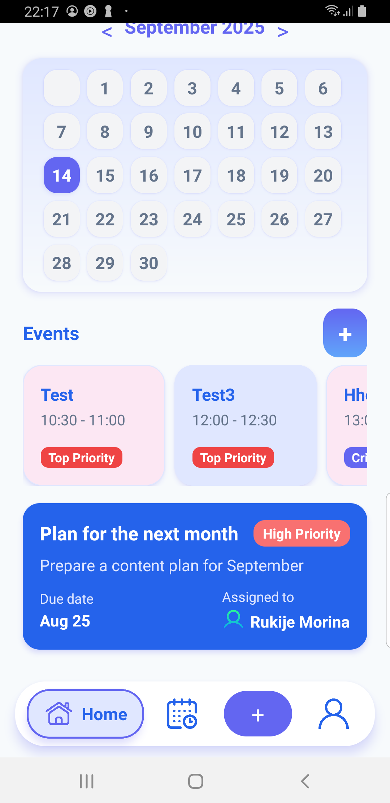
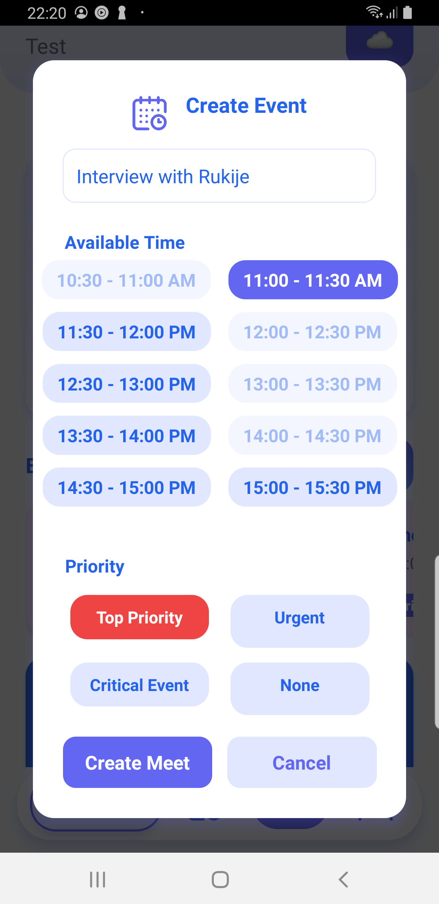
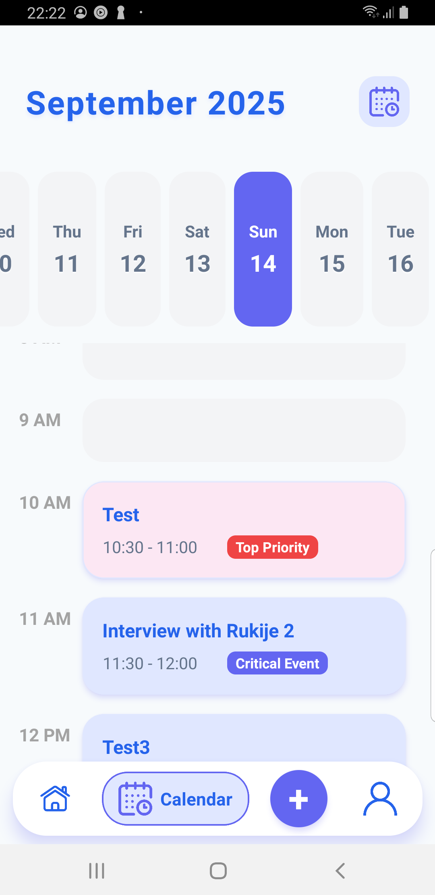
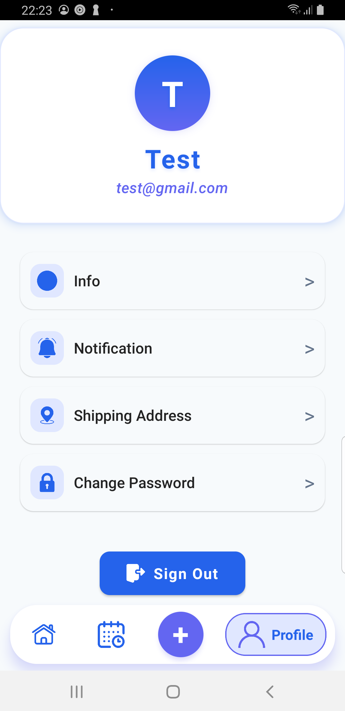
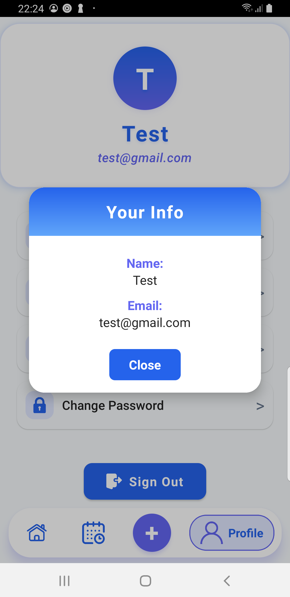

# React Native Calendar App

This is a [**React Native**] (Calendar App) project, bootstrapped using [`@react-native-community/cli`]

---

## Features

- **Modern Calendar App UI** with Home (Dashboard), Calendar View, and Profile screens
- **Reusable Components:** Custom `Navbar` (pill-shaped bottom navigation) and `Header` (centered title) used across all screens
- **Event Management:** View and manage events for each day; events are stored in AsyncStorage for persistence
- **Redux Integration:** Event state is managed with Redux in the Calendar View for predictable updates
- **Biometric Authentication:** Face ID/Fingerprint login support (if available on your device)
- **Navigation:** React Navigation with clear tab-to-screen mapping and tab highlighting
- **Responsive Design:** Clean, modern UI with rounded elements and smooth navigation

---

## What You Can Do With This App

- **Sign in** using email/password or biometric authentication (Face ID)
- **Navigate** between Home (Dashboard), Calendar View, and Profile screens using the bottom navbar
- **View a monthly calendar** and select any day to see its events in a timeline
- **Events** are displayed per day and persist between app launches
- **Profile screen** to view or edit your user information
- **Consistent, modern UI** with reusable components

---

## Getting Started

### 1. Install dependencies

```sh
npm install
```

### 2. Start Metro

```sh
npm start
```

### 3. Run the app

#### Android

```sh
npx react-native run-android
```


## Usage

- **Sign in** to access your dashboard.
- Use the **navbar** to switch between Home, Calendar, and Profile.
- **View and manage events** for any day in the calendar.
- **Biometric login** is available if your device supports it.

---

## Logic Overview

- **State Management:**  
  Events are managed with Redux in the Calendar View for reliable updates and sharing state between components.
- **Persistence:**  
  Events are saved in AsyncStorage, so they remain after closing the app.
- **Navigation:**  
  React Navigation handles screen transitions and tab highlighting.
- **Authentication:**  
  Biometric login is supported for quick and secure access.

---
## Software Requirements

To run this application, you must have the following software installed:

| Software                | Version (recommended) |
|-------------------------|----------------------|
| Node.js                 | 20.x                 |
| npm                     | 10.x                 |
| React Native CLI        | 0.81.x               |
| Java JDK (for Android)  | 17                   |
| Android Studio          | Latest stable        |
| Xcode (for iOS)         | 14.x or newer        |
| CocoaPods (for iOS)     | 1.12.x or newer      |
| Git                     | 2.30.x or newer      |

### Key npm dependencies

- `react-native`: **0.81.4**
- `react`: **19.1.1**
- `react-native-biometrics`: **3.0.1**
- `react-native-vector-icons`: **10.3.0**

> Make sure to also install other dependencies used in this project, such as `@reduxjs/toolkit`, `react-redux`, and `@react-navigation/native`, with compatible versions.

## Screenshots

<p align="center">


  
  
    
  
  
  
  
    

</p>

